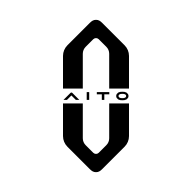

<h1 align="center"><strong>重要免责声明</strong></h1>

<h2 align="center"><strong>本项目存在较高法律、账号、隐私和车辆安全风险。使用前请完整阅读本声明。</strong></h2>

<p>
  <strong>
    本项目不是 AITO、问界、赛力斯、华为或鸿蒙智行官方项目，也未获得上述品牌、厂商或平台的授权、认可或支持。
    本项目仅用于个人 Home Assistant 集成开发、技术验证和学习研究。车辆属于高风险联网设备，相关数据可能涉及车辆安全、隐私数据、云端服务规则以及辅助驾驶相关场景。
    任何使用、传播、修改或部署行为均由使用者自行判断并承担全部责任。
  </strong>
</p>

<p>
  <strong>
    请勿将本项目用于商业用途、批量调用、绕过限制、未授权账号、未授权车辆、公开服务或任何可能违反法律法规、平台规则、车辆服务条款的用途。
    请勿公开日志、诊断文件、Home Assistant 存储文件、备份、账号信息、车辆信息、位置数据、截图或任何敏感凭据。
  </strong>
</p>

<p>
  <strong>
    使用本项目造成的账号异常、服务中断、车辆数据错误、隐私泄露、车辆相关风险、法律纠纷或任何直接/间接损失，均由使用者自行承担。
    如发现风险、侵权或安全问题，请联系 493355621@qq.com 以便及时处理。不同意以上内容，请不要安装或使用本项目。
  </strong>
</p>

---

<p align="center">
  
</p>

<h1 align="center">AITO Home Assistant</h1>

<p align="center">
  
  
</p>

## 许可状态

本项目代码和文档以 GNU General Public License v3.0 only（GPL-3.0-only）发布，详见仓库根目录的 `LICENSE` 文件。
第三方品牌、商标、服务名称和图标仍归各自权利人所有；本仓库不授予任何第三方商标、品牌或平台服务相关权利。

## 快速上手

### 1. 安装

将 `custom_components/aito` 复制到 Home Assistant 配置目录：

```text
/config/custom_components/aito
```

复制完成后，重启 Home Assistant。

### 2. 添加集成

在 Home Assistant 中进入：

```text
设置 -> 设备与服务 -> 添加集成 -> AITO
```

如果列表中没有看到 `AITO`，请确认：

- 目录路径是 `/config/custom_components/aito`
- Home Assistant 已经重启
- `manifest.json` 位于 `aito` 目录中

### 3. 完成登录

添加集成时，按页面提示输入：

- 华为账号手机号
- 华为账号密码
- 短信验证码

建议为 Home Assistant 单独准备一个专用华为账号，避免与日常手机 App 的车辆服务会话互相影响。

### 4. 等待初始化

提交短信验证码后，集成会等待账号和车辆凭据建立完成，并在本地保存必要资产后再创建设备和实体。

如果登录失败，请优先检查手机号、密码、短信验证码和账号风控状态。不要公开 Home Assistant 日志、诊断文件或 `.storage` 内的任何文件。

### 5. 查看实体

配置成功后，进入 AITO 设备页面查看自动生成的实体。

实体数量和字段取决于车辆、账号权限以及云端实际返回的数据。README 不承诺固定实体列表，请以 Home Assistant 实际显示为准。

### 6. 调整轮询间隔

默认轮询间隔为 `30` 秒。

可在集成选项中调整轮询间隔。过低的轮询频率可能增加云端服务压力，也可能导致请求失败或账号异常。

## 数据与隐私

本集成运行在用户自己的 Home Assistant 环境中。维护者不会通过本项目主动收集、接收或上传用户的账号、车辆或位置数据。

为完成登录和轮询，本集成会在 Home Assistant 本地保存必要的账号会话信息、访问令牌、刷新令牌、设备标识、车辆标识、车辆状态和位置等数据。请妥善保护 Home Assistant 主机、备份、诊断文件、日志和 `.storage` 目录。
